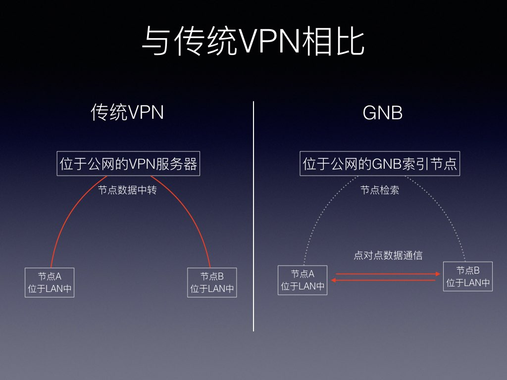
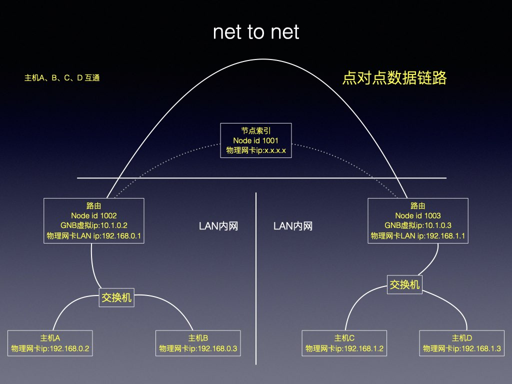
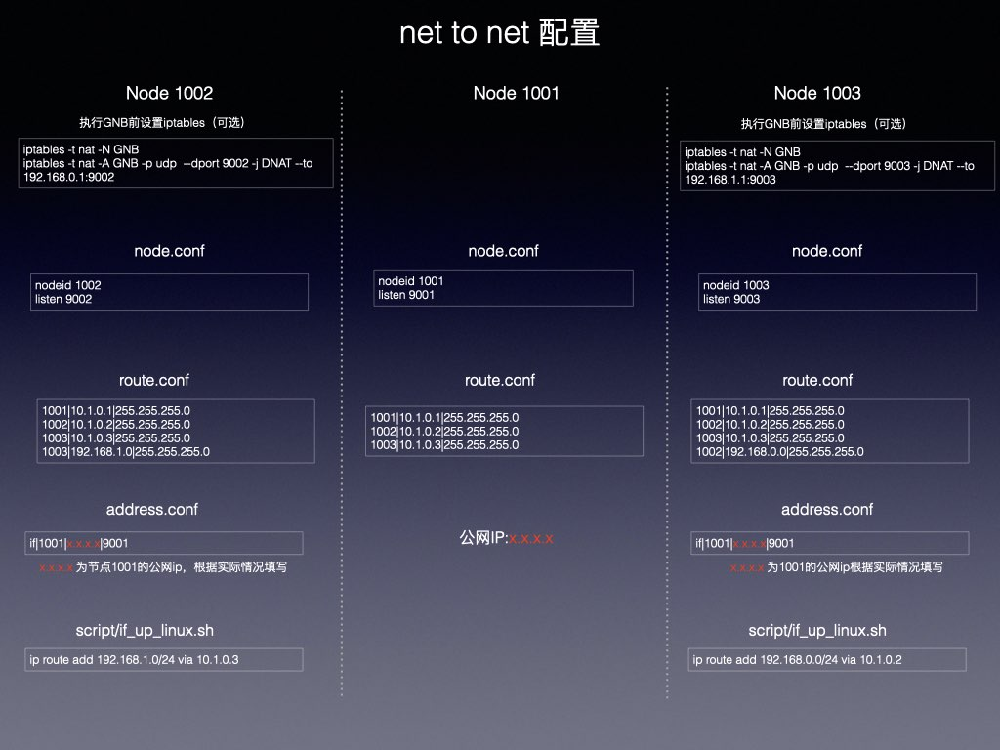

# GNB
[GNB](https://github.com/gnbdev/gnb "GNB")是一个开源的去中心化的具有极致内网穿透能力的通过P2P进行三层网络交换的VPN。

[gnb_udp_over_tcp](https://github.com/gnbdev/gnb_udp_over_tcp "gnb_udp_over_tcp")是一个为GNB开发的通过tcp链路中转UDP分组转发的服务，也可以为其他基于UDP协议的服务中转数据。

[GNBFrontend](https://github.com/XyloseYuthy/GNBFrontend "GNBFrontend")是由志愿者开发维护的开源的GNB的图形界面前端。

出于安全考虑，GNB项目相关代码会开源。

## 内网穿透 P2P VPN VPN

GNB独有的去中心化组网技术可以将分布在世界不同地方的计算机组成一个虚拟局域网，即使这些计算机深藏于没有公网ip的局域网里，不需要公网服务器中转就可以实现TCP/IP通讯。

使用某些网络设备生产商的技术方案虽然可以达到上述目的，但需要花费一定的资金购买网络的硬件产品与软件许可，与此同时可能还需要花费一定的资金去搭建公网中转服务器以及中转服务器带宽的开销，节点要得到更多的带宽，就意味着更高的IDC预算。

GNB网络拥有极致的nat（内网）穿透能力使得主机之间能够尽最大的可能点对点直连，数据分组不经公网服务器中转，边缘节点之间的带宽不受限、不占用公网节点带宽。一台加入GNB网络主机可以放在家中通过家庭宽带接入互联网，而用户在家以外的地方访问这台主机就像访问公网服务器一样，所产生的一切费用似乎就只有主机消耗电费以及家庭宽带的费用。

net to net 模式还可以将分散世界各地不同的局域网组成一个可以互通的虚拟局域网。

深藏在内网中通过nat方式联网的计算机需要部署在公网的index节点找到其他同样处于内网中的主机建立点对点的虚拟链路。

GNB的index节点的角色类似于BT协议中的Tracker，由一部分GNB网络志愿者提供。在绝大多数情况下index节点仅为GNB网内主机提供地址索引，不会为GNB节点中转数据。

一部分志愿者提供的GNB的forward节点可以为极端情况下暂时无法进行点对点通信的主机进行数据中转，而GNB主机之间的非对称数据加密使得 forward 节点无法窥探中转的数据。

在无法建立点对点通信的极端情况下，是否通过公网 forward 节点中转数据和使用哪个可信任的 forward 节点中转数据，完全取决在主机的拥有者对GNB 节点的设置。事实上，即便处于极其复杂的网络环境，GNB优越链路能力也可以随时随地建立虚拟数据链路，GNB甚至会为网络中的主机创建多个虚拟链路，择速度最优路径发送数据分组。

在GNB网络中的主机拥有唯一独立的虚拟 ipv4 和 ipv6 地址，因而基于GNB网络开发各种网络通信应用同样也可以实现去中心化。假如要基于GNB网络开发一个即时通讯系统，由于已经能够明确知道每个对端主机的虚拟ip地址及通信公钥，因而可以不需要搭建一个复杂的中转服务器就能直接把消息发送到对端的主机。

## 极致的链路能力

GNB有四套机制确保在主机所在网络发生变化时能够快速恢复数据链路并且在某些场景下还能保持应用层的网络连接，以下是一个经过反复测试的例子：
1、在肯德基打开苹果笔记电脑本接入肯德基的免费Wi-Fi；
2、在苹果笔记电脑启动GNB的边缘节点，此时可以通过 ssh 客户端登录到家中的同样是接入GNB网络的一台Linux；
3、合上笔记本电脑并带着走出肯德基。
4、来到麦当劳，打开笔记本，接入麦当劳的免费Wi-Fi，稍等半分钟网络恢复；
5、此时苹果笔记本中的 ssh 客户端与家中Linux的ssh的tcp连接没有断开，依然是通的。

以上例子仅是说明应用层无法感知GNB网络的虚拟链路的变化以及GNB在网络发生变化时快速恢复链路的能力。事实上，对于一些有心跳机制的tcp通信协议如果在一定时间内没有收到心跳包，应用层就会自动断开连接。

## 数据安全

GNB节点间基于椭圆曲线数字签名实现可靠的身份验证

GNB节点之间的通信密钥由 ED25519共享密钥+同步时钟（可选）+sha512构成

在同步时钟的作用下，节点的加密密钥可以每分钟或每小时同步更新一次，但这要求各节点时钟的必须要同步，在无法确保主机时钟同步的情况下可以选择关闭这个特性。

## 多平台支持

GNB用C语言开发，编译时不需要引用第三方库文件，可以方便移植到当前流行的操作系统上。

GNB目前支持的操作系统及平台有 Linux_x86_64，Windows10_x86_64， macOS，FreeBSD_AMD64，OpenBSD_AMD64，树莓派，OpenWRT；大至服务器环境，桌面系统，小至仅有32M内存的OpenWRT路由器都能很好的运行GNB网络。

以下一些GNB的技术文档：

[GNB Linux 部署说明](docs/gnb_for_linux_manual.md)

[GNB 配置图图解](docs/gnb_setup.md)

## gnb的命令行参数

执行`gnb -h`可以看到gnb在当前平台所支持的参数，由于 gnb ver 1.2 还有一些细节在调整，这里只对一些已经明确固定下来的参数进行解释

|参数|说明|明细|
|-|-|-|
|-c, --conf|config path|指定gnb node的目录，这个在启动gnb时参数是必须的，不可少的|
|-i, --ifname|TUN Device NAME|指定虚拟网卡的的名字，这在macOS和windows上是无效的，这些系统对虚拟网卡的命名有自己的规则|
|-4, --ipv4-only|Use IPv4 Only|禁用ipv6，gnb将不通过ipv6地址收发数据，gnb开启的虚拟网卡不会绑定ipv6地址，由于禁用了ipv6，因此gnb可以设置小于1280的mtu,对于一些限制比较多的网络环境可以利用这个特性尝试使用更小的mtu|
|-6, --ipv6-only|Use IPv6 Only|禁用ipv4，gnb将不通过ipv4地址收发数据，gnb开启的虚拟网卡不会绑定ipv4地址|
|--log-file-path|log file path|指定输出文件日志的路径，如果不指定将不会产生日志文件，当前gnb的日志系统可定制化程度不高|
|--mtu|TUN Device MTU ipv4 532, ipv6 1280|虚拟网卡的mtu，在比较糟糕的网络环境下ipv4可以设为532,ipv6不可小于1280|
|--crypto|ip frame crypto 'xor' or 'rc4' or 'none' default is 'xor'|设定gnb传输数据的加密算法，选择'none'就是不加密，默认是xor使得在CPU运算能力很弱的硬件上也可以有较高的数据吞吐能力。未来会支持aes算法。两个gnb节点必须保持相同的加密算法才可以正常通讯。|
|--crypto-key-update-interval|'hour' or 'minute' or none default is 'none'|gnb的节点之间可以通过时钟同步变更密钥，这依赖与节点的时钟必须保持较精确的同步，由于考虑到实际环境中一些节点时钟可能2无法及时同步时间，因此这个选项默认是不启用，如果运行gnb的节点能够保证同步时钟，可以考虑选择一个同步更新密钥的间隔，这可以提升一点通讯的安全性。关于加密的部分，将来会有专门的文章介绍|
|--multi-index-type|'simple-fault-tolerant' or 'simple-load-balance' default is 'simple-fault-tolerant'|如果设置了多个index节点，那么可以选择一个选取index节点的方式，负载均衡或在容错模式，这个选项目前还不完善，容错模式只能在交换了通讯密钥的节点之间进行|
|--multi-forward-type|'simple-fault-tolerant' or 'simple-load-balance' default is 'simple-fault-tolerant'|如果有多个forward节点，可以选择一个forward节点的方式，负载均衡或在容错模式|
|--set-socket-if-name|example: 'eth0', 'eno1', only for unix-like os|在unix-like系统上可以让gnb的数据通过指定物理网卡发送，这里需要用户输入物理网卡的名字，Windows不支持这个特性，也看不到该选项|
|--set-if-dump|'dump the interface data frame 'on' or 'off' default is 'off'|把经过gnb开启的虚拟网卡的ip分组在日志中输出，这样方便调试系统|     
|--disabled-tun|disabled TUN Device, index node only|不启动虚拟网卡，仅作为gnb index服务启动，由于没有启动虚拟网卡，因此设了这个选项时不需要用root权限去启动gnb|
|--pid-file|pid file|指定保存gnb进程id的文件，方便通过脚本去kill进程，如果不指定这个文件，pid文件将保存在当前节点的配置目录下|  
|--node-cache-file|node address cache file|gnb会定期把成功连通的节点的ip地址和端口记录在一个缓存文件中，gnb进程在退出后，这些地址信息不会消失，重新启动进程时会读入这些数据，这样新启动gnb进程就可能不需通过index 节点查询曾经成功连接过的节点的地址信息|
