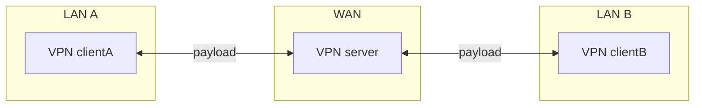
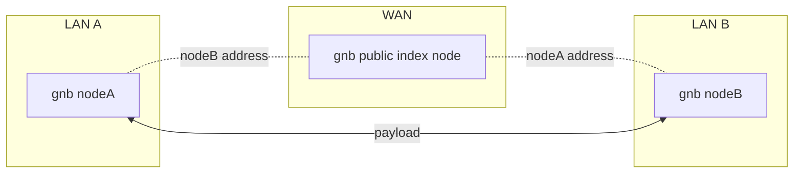
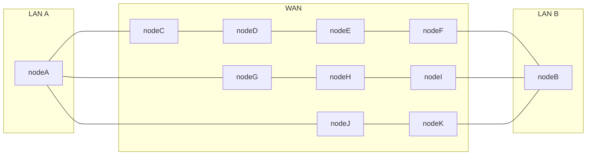
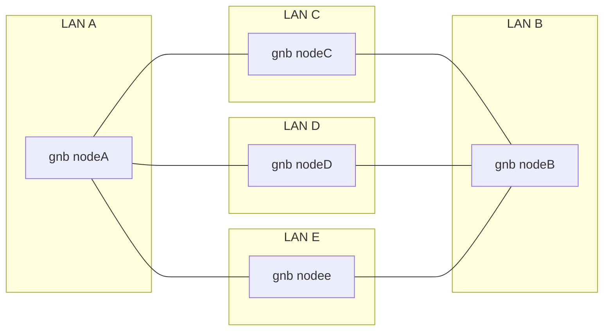
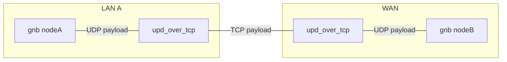

# OpenGNB
The communication protocol of opengnb version 1.5.0 has been upgraded and is not compatible  
[Chinese](/README_CN.md) [English](/README.md)

*Note: Most of the content of this article is translated by Google translate from the Chinese version of the "OpenGNB User Manual", the content of this article is subject to the Chinese version.*

[OpenGNB](https://github.com/gnbdev/opengnb "OpenGNB") is an open source P2P decentralized Software Defined Virtual Network with extreme intranet penetration capability,Allows you to combine your company-home network into a direct-access LAN.

All code related to the GNB project is released as open source, and the currently released source code supports the following platforms: FreeBSD Linux OpenWRT Raspberrypi OpenBSD macOS


## GNB Features

1. Intranet penetration P2P VPN
    - No public IP required
2. Extreme link capability
    - Unlimited speed effects
3. Data Security
    - Reliable authentication between GNB nodes based on elliptic curve digital signature
4. Multi-platform support
    - GNB is developed in C language. It does not need to refer to third-party library files when compiling. It can be easily ported to the current popular operating systems. Currently supported operating systems and platforms include Linux_x86_64, Windows10_x86_64, macOS, FreeBSD_AMD64, OpenBSD_AMD64, Raspberry Pi, OpenWRT; as big as server environment, desktop system, as small as OpenWRT router with only 32M memory can run GNB network very well.


### Standard VPN payload forwarding




### GNB payload standard forwarding

NAT Traversal point to point



### GNB payload relay forwarding



### GNB payload unified forwarding



### GNB payload via tcp forwarding




## GNB Quick Start

* Linux platform

### Step 1: Download and compile the GNB source code project

```
git clone https://github.com/gnbdev/opengnb.git
cd opengnb
make -f Makefile.linux install
```
After compiling, you can get `gnb` `gnb_crypto` `gnb_ctl` `gnb_es` files in the `opengnb/bin/` directory.

### Step 2: Quickly deploy GNB nodes

Copy `gnb` `gnb_crypto` `gnb_ctl` `gnb_es` to host A and host B respectively.

Assuming that host A and host B need to temporarily penetrate the intranet interconnection in two different LANs, the fastest way is to run gnb through lite mode. In lite mode, asymmetric encryption is not enabled, and only through **passcode** and The node id generates the encryption key, so the security will be much less modular than working with asymmetric encryption.

**passcode** is a 32-bit hexadecimal string with a length of 8 characters, which can be represented as **0xFFFFFFFF** or **FFFFFFFF**, under a public index **passcode** is the same GNB node It is considered to be a node on the same virtual network. Please choose a **passcode** that will not be the same as other users as much as possible. Here, for the convenience of demonstration, the **passcode** is selected as `12345678`, and the parameter **-p ** Used to specify the **passcode** to start the node. Do not use such a simple **passcode** in actual use, it may conflict with other users who also use `12345678` as **passcode** and cause communication failure.

### Step 3: Start the first node

Execute with **root** on host A

```
gnb -n 1001 -I "120.76.206.113/9001" --multi-socket=on -p 12345678
```

After the startup is successful, execute ip addr on host A to see the GNB node IP

```
3: gnb_do:mtu 1280 qdisc fq_codel state UNKNOWN group default qlen 500
    link/none
    inet 10.1.0.1/16 scope global gnb_tun
       valid_lft forever preferred_lft forever
    inet6 64:ff9b::a01:1/96 scope global
       valid_lft forever preferred_lft forever
    inet6 fe80::402:c027:2cf:41f9/64 scope link stable-privacy
       valid_lft forever preferred_lft forever
```

### Step 4: Start the second node

Execute with **root** on host B

```
gnb -n 1002 -I "120.76.206.113/9001" --multi-socket=on -p 12345678
```
After the startup is successful, execute ip addr on host B to see the GNB node IP

```
3: gnb_do:mtu 1280 qdisc fq_codel state UNKNOWN group default qlen 500
    link/none
    inet 10.1.0.2/16 scope global gnb_tun
       valid_lft forever preferred_lft forever
    inet6 64:ff9b::a01:2/96 scope global
       valid_lft forever preferred_lft forever
    inet6 fe80::a6cf:9f:e778:cf5d/64 scope link stable-privacy
       valid_lft forever preferred_lft forever
```

### Step 5: Test GNB Node Interoperability

At this point, if host A and host B nat penetrate successfully and ensure that there is no firewall intervention on the host, they can ping each other's virtual ip.

Execute on host A

```
root @ hostA: ~ # ping 10.1.0.2
PING 10.1.0.2 (10.1.0.2) 56(84) bytes of data.
64 bytes from 10.1.0.2: icmp_seq=1 ttl=64 time=2.13 ms
64 bytes from 10.1.0.2: icmp_seq=2 ttl=64 time=2.18 ms
64 bytes from 10.1.0.2: icmp_seq=3 ttl=64 time=2.38 ms
64 bytes from 10.1.0.2: icmp_seq=4 ttl=64 time=2.31 ms
64 bytes from 10.1.0.2: icmp_seq=5 ttl=64 time=2.33 ms
```

Execute on host B

```
root @ hostA: ~ # ping 10.1.0.1
PING 10.1.0.1 (10.1.0.1) 56(84) bytes of data.
64 bytes from 10.1.0.1: icmp_seq=1 ttl=64 time=2.34 ms
64 bytes from 10.1.0.1: icmp_seq=2 ttl=64 time=1.88 ms
64 bytes from 10.1.0.1: icmp_seq=3 ttl=64 time=1.92 ms
64 bytes from 10.1.0.1: icmp_seq=4 ttl=64 time=2.61 ms
64 bytes from 10.1.0.1: icmp_seq=5 ttl=64 time=2.39 ms
```

The simplest use process of the above GNB lite mode, GNB lite mode has 5 built-in nodes, if you need more hosts to participate in the networking and use a more secure asymmetric encryption method to protect the data communication of GNB, please read the following documents carefully.


## Deep understanding of GNB guidelines


The role of the index node of GNB is similar to the Tracker in the BT protocol, which is provided by some GNB network volunteers. In most cases, the `index` node only provides the address index for the hosts in the GNB network, and will not transfer data for the GNB node.

The `forward` node of GNB provided by some volunteers can perform data transfer for hosts that are temporarily unable to perform point-to-point communication in extreme cases, and the asymmetric data encryption between GNB hosts makes it impossible for the `forward` node to spy on the transferred data.

In extreme cases where peer-to-peer communication cannot be established, whether to transfer data through the public network `forward` node and which trusted forward node to use to transfer data depends entirely on the host owner's settings on the GNB node. In fact, even in an extremely complex network environment, GNB's superior link capability can establish virtual data links anytime, anywhere. GNB will even create multiple virtual links for hosts in the network, and choose the optimal speed path to send data packets.

Here are the available `index` nodes provided by volunteers

```
i|0|101.32.178.3|9001
```


## Limitations of GNB

1. GNB does not support *Classless Inter-Domain Routing (CIDR)*, only supports Class A, B, C networks;
2. GNB does not forward IP frames of Default route. In `host to net` and `net to net` modes, GNB can forward data for specific subnets, but does not support full traffic forwarding;
3. The IPV6 of GNB cannot work normally under Windows platform;
4. The work of GNB using virtual network card realizes Layer 3 switching in TUN mode, and does not support Layer 2 switching if it does not support TAP mode;


### GNB related documentation

* [GNB User Manual](docs/gnb_user_manual_en.md)
* [Debug diagnostics for GNB](docs/gnb_diagnose_cn.md)


## GNB on OpenWRT

GNB supports the OpenWRT platform and needs to be compiled by the user.


## GNB on Linux distributions

The systemd script was made by [Jin Buguo](https://github.com/jinbuguo) for the GNB project

The [atzlinux](https://www.atzlinux.com) project has made a deb format software package under Linux for the GNB project, and contributed it to become the official Debian software package.

You may install opengnb on Debian 12 (bookworm) :

```bash
apt install opengnb
```


- Arch Linux

The AUR package of Arch Linux was made by [taotieren](https://github.com/taotieren) for the GNB project. The installation method is as follows
```bash
# install distribution
yay -Sy opengnb
# Install the development version
yay -Sy opengnb-git
```
For details, please visit [https://aur.archlinux.org/packages/opengnb/](https://aur.archlinux.org/packages/opengnb/)

[https://aur.archlinux.org/packages/opengnb-git/](https://aur.archlinux.org/packages/opengnb-git/)

[Download the compiled and released version of gnb on each platform](https://github.com/gnbdev/gnb_build "gnb_build")


[gnb_udp_over_tcp](https://github.com/gnbdev/gnb_udp_over_tcp "gnb_udp_over_tcp") is a service developed for GNB that forwards UDP packets through tcp link, and can also forward data for other services based on UDP protocol.

---
[Disclaimer](docs/disclaimer_cn.md) 
