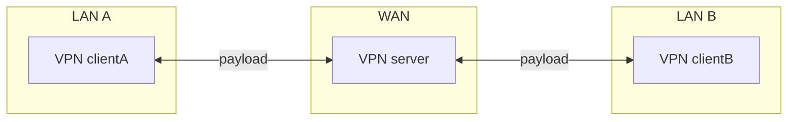
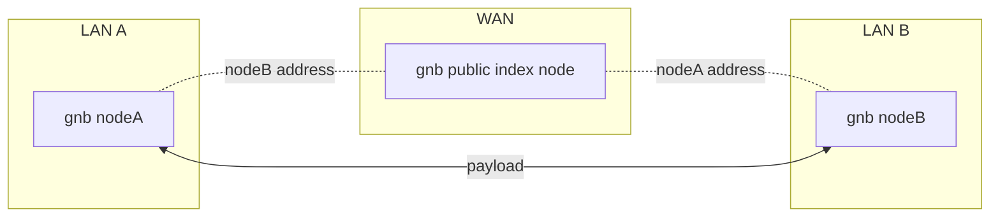
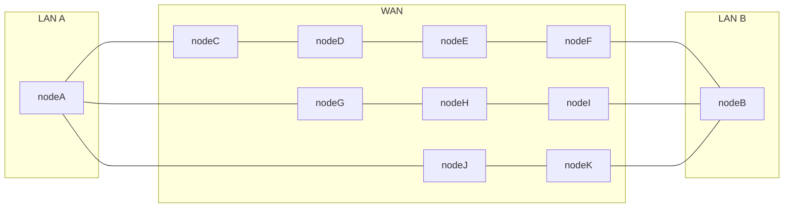
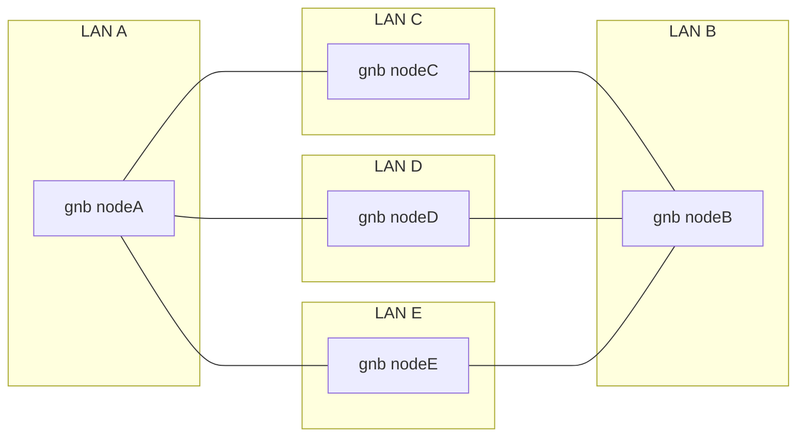
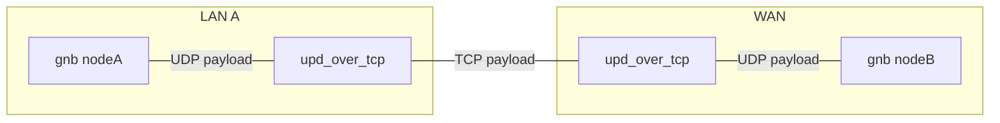

# OpenGNB

version 1.3.0.0  protocol version 1.2.0

[Chinese](/README_CN.md)  [English](/README.md)

[OpenGNB](https://github.com/gnbdev/opengnb "OpenGNB") 是一个开源的 P2P 去中心化的具有极致的内网穿透能力的软件自定义虚拟网络(Software Defined Virtual Network),可以让你把公司-家庭网络组成直接访问的局域网。

## GNB 特点

1. 极致的链路能力
  - 内网穿透,无需公网IP,无限速影响，***upnp***，***multi index***，***port detect***,***multi socket*** 等策略实现内网穿透
  - Discover in lan 自动发现局域网内其他节点建立 P2P 通信
  - Unified Forwarding 自动通过已经建立 P2P 通信的节点转发 IP 分组，多节点重传 IP 分组
  - Relay Forwarding 高度自定义中继路由，IP 分组发往下一个中继点前都会作加密处理
  - Standard Forwarding 用尽一切办法无法建立起 P2P 通信的节点可以通过位于公网 forward 节点中继 IP 分组

2. 数据安全
    - 基于椭圆曲线数字签名实现可靠的身份验证
    - 根据时间同步变更通信密钥
    - 默认选项下对日志中的敏感信息进行隐藏

3. 支持通过多核CPU加速对数据分组处理

4. 多平台支持
    -  GNB 用 C 语言开发，项目相关代码以开源方式发布, 编译时不需要引用第三方库文件，可以方便移植到当前流行的操作系统上,目前支持的操作系统及平台有 Linux_x86_64，Windows10_x86_64， macOS，FreeBSD_AMD64，OpenBSD_AMD64，树莓派，OpenWRT；大至服务器环境，桌面系统，小至仅有 32M 内存的OpenWRT路由器都能很好的运行 GNB 网络。


### Standard VPN payload forwarding




### GNB payload standard forwarding

NAT Traversal point to point



### GNB payload relay forwarding



### GNB payload unified forwarding



### GNB payload via tcp forwarding




## GNB 快速上手

* Linux 平台

### 步骤1: 下载编译 GNB 源码工程

```
git clone https://github.com/gnbdev/opengnb.git
cd opengnb
make -f Makefile.linux install
```
编译完毕后在 `opengnb/bin/` 目录下可以得到 `gnb` `gnb_crypto` `gnb_ctl` `gnb_es` 这几个文件。

### 步骤2: 快捷部署 GNB 节点

把`gnb` `gnb_crypto` `gnb_ctl` `gnb_es` 分别拷贝到主机 A 和主机 B 上。

假设主机 A 和主机 B 分别在两个不同的局域网里需要临时穿透内网互联，最快捷的途径通过 lite 模式运行 gnb，在 lite 模式下没有启用非对称加密，仅通过 **passcode** 和节点 id 生成加密密钥，因此安全性会比使用非对称加密的工作模块式低很多。

**passcode** 是一个长度为8个字符的32bit的16进制字符串，可以表示为 **0xFFFFFFFF** 或 **FFFFFFFF**， 在一个 public index 下 **passcode** 相同的 GNB 节点被认为是同一个虚拟网络上的节点，请尽可能选择一个不会跟其他用户相同的 **passcode**，这里为了方便演示选定 **passcode** 为 `12345678`, 参数 **-p** 用于指定启动节点的 **passcode**。在实际使用过程中请勿使用这样简单 **passcode**，这可能会与其他同样使用`12345678`作为的 **passcode** 的用户冲突导致通信失败。

### 步骤3: 启动第一个节点

主机 A 上用 **root** 执行

```
gnb -n 1001 -I "120.76.206.113/9001" --multi-socket=on -p 12345678
```

启动成功后，主机 A 上执行 ip addr 可见 GNB 节点 IP

```
3: gnb_tun: <POINTOPOINT,MULTICAST,NOARP,UP,LOWER_UP> mtu 1280 qdisc fq_codel state UNKNOWN group default qlen 500
    link/none
    inet 10.1.0.1/16 scope global gnb_tun
       valid_lft forever preferred_lft forever
    inet6 64:ff9b::a01:1/96 scope global
       valid_lft forever preferred_lft forever
    inet6 fe80::402:c027:2cf:41f9/64 scope link stable-privacy
       valid_lft forever preferred_lft forever
```

### 步骤4: 启动第二个节点

主机 B 上用 **root** 执行

```
gnb -n 1002 -I "120.76.206.113/9001" --multi-socket=on -p 12345678
```
启动成功后，主机 B 上执行 ip addr 可见 GNB 节点 IP

```
3: gnb_tun: <POINTOPOINT,MULTICAST,NOARP,UP,LOWER_UP> mtu 1280 qdisc fq_codel state UNKNOWN group default qlen 500
    link/none
    inet 10.1.0.2/16 scope global gnb_tun
       valid_lft forever preferred_lft forever
    inet6 64:ff9b::a01:2/96 scope global
       valid_lft forever preferred_lft forever
    inet6 fe80::a6cf:9f:e778:cf5d/64 scope link stable-privacy
       valid_lft forever preferred_lft forever
```

### 步骤5：测试 GNB 节点互通

此时，如果主机 A 和主机 B nat 穿透成功并确保主机上没有防火墙的干预的情况下，可以互相 ping 到对方的虚拟 ip。

主机 A 上执行

```
root@hostA:~# ping 10.1.0.2
PING 10.1.0.2 (10.1.0.2) 56(84) bytes of data.
64 bytes from 10.1.0.2: icmp_seq=1 ttl=64 time=2.13 ms
64 bytes from 10.1.0.2: icmp_seq=2 ttl=64 time=2.18 ms
64 bytes from 10.1.0.2: icmp_seq=3 ttl=64 time=2.38 ms
64 bytes from 10.1.0.2: icmp_seq=4 ttl=64 time=2.31 ms
64 bytes from 10.1.0.2: icmp_seq=5 ttl=64 time=2.33 ms
```

主机 B 上执行

```
root@hostA:~# ping 10.1.0.1
PING 10.1.0.1 (10.1.0.1) 56(84) bytes of data.
64 bytes from 10.1.0.1: icmp_seq=1 ttl=64 time=2.34 ms
64 bytes from 10.1.0.1: icmp_seq=2 ttl=64 time=1.88 ms
64 bytes from 10.1.0.1: icmp_seq=3 ttl=64 time=1.92 ms
64 bytes from 10.1.0.1: icmp_seq=4 ttl=64 time=2.61 ms
64 bytes from 10.1.0.1: icmp_seq=5 ttl=64 time=2.39 ms
```

以上是 GNB lite 模式的最简使用过程，GNB lite 模式内置5个节点，如果需要更多主机参与组网和使用更安全的非对称加密方式保护 GNB 的数据通信，请仔细阅读下面的文档。


## 深入理解 GNB 指引


GNB 的 index 节点的角色类似于 BT 协议中的 Tracker，由一部分 GNB 网络志愿者提供。在绝大多数情况下`index`节点仅为 GNB 网内主机提供地址索引，不会为 GNB 节点中转数据。

GNB 主机之间的非对称数据加密使得 **forward** 节点无法窥探中转的数据。

在无法建立点对点通信的极端情况下，是否通过公网 **forward** 节点中转数据和使用哪个可信任的 **forward** 节点中转数据，完全取决在主机的拥有者对 GNB 节点的设置。事实上，即便处于极其复杂的网络环境，GNB 优越链路能力也可以随时随地建立虚拟数据链路，GNB 甚至会为网络中的节点创建多个虚拟链路，择速度最优路径发送数据分组。


这是由志愿者提供的可用`index`节点

```
i|0|101.32.178.3|9001
i|0|47.93.29.76|9001
i|0|45.78.14.231|9001
i|0|110.238.106.225|9001
i|0|usa.homedns.net|9001
```


## GNB 的限制

1. GNB 不支持 *无类别域间路由（Classless Inter-Domain Routing、CIDR）*,  仅支持 A,B,C 类网络;
2. GNB 不转发默认路由（Default route）的 IP 帧，在`host to net`和`net to net` 模式下 GNB 可以为特定的子网的数据做转发，但不支持全流量转发;
3. 在 Windows 平台下 GNB 的 IPV6 目前无法正常工作;
4. GNB 的使用虚拟网卡的工作在 TUN 模式下实现三层交换,不支持 TAP 模式即不支持二层交换;


### GNB 相关文档

* [GNB 用户手册](docs/gnb_user_manual_cn.md)
* [GNB 的调试诊断](docs/gnb_diagnose_cn.md)


## GNB在OpenWRT上

GNB 支持 OpenWRT 平台,需要用户自行编译。


## GNB 在 Linux 发行版上

[金步国](https://github.com/jinbuguo) 为 GNB 项目制作了 systemd 的脚本

[铜豌豆 Linux](https://www.atzlinux.com)项目为 GNB 项目制做了 Linux 下的 deb 格式软件包，将其贡献成为 Debian 官方软件包.

可以在 Debian 12 (bookworm) 下直接安装：

```bash
apt install opengnb
```

- Arch Linux

 [taotieren](https://github.com/taotieren) 为 GNB 项目制作了 Arch Linux 的 AUR 包

详情请访问 [https://aur.archlinux.org/packages/opengnb/](https://aur.archlinux.org/packages/opengnb/)

[https://aur.archlinux.org/packages/opengnb-git/](https://aur.archlinux.org/packages/opengnb-git/)


### 相关链接

[wuqiong](https://www.github.com/wuqiong) 为 GNB 在Windows平台上开发了 wintun 虚拟网卡的接口模块


[gnb 在各平台的编译发行版下载](https://github.com/gnbdev/gnb_build "gnb_build")


[gnb_udp_over_tcp](https://github.com/gnbdev/gnb_udp_over_tcp "gnb_udp_over_tcp") 是一个为 GNB 开发的通过 tcp 链路中转 UDP 分组转发的服务，也可以为其他基于 UDP 协议的服务中转数据。

---
[免责声明](docs/disclaimer_cn.md)
