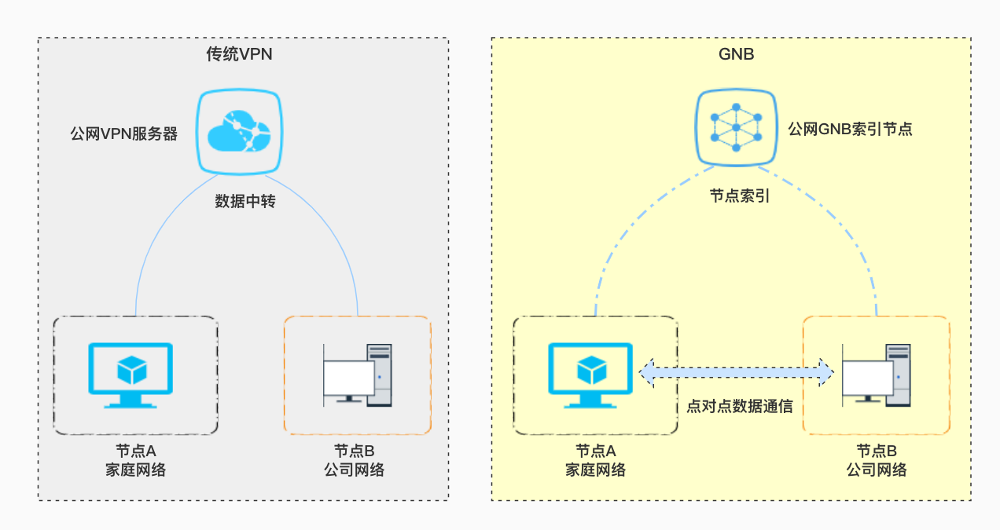

# OpenGNB 
[Chinese](/README.md)  [English](/README_EN.md)  [Russian](/README_RU.md) 

*Примечание. Большая часть содержания этой статьи переведена с помощью переводчика Google с китайской версии «Руководства пользователя OpenGNB», содержание этой статьи зависит от китайской версии.*

[OpenGNB](https://github.com/gnbdev/opengnb "OpenGNB") — это децентрализованная P2P-VPN с открытым исходным кодом и возможностью проникновения во внутреннюю сеть.

> Позволяет превратить домашнюю сеть компании в локальную сеть с прямым доступом.

Весь код, связанный с проектом GNB, выпускается с открытым исходным кодом, а выпущенный в настоящее время исходный код поддерживает следующие платформы: FreeBSD Linux OpenWRT Raspberrypi OpenBSD macOS




## GNB особенности

1. Проникновение в интранет P2P VPN
    - Публичный IP-адрес не требуется
2. Максимальная возможность связи
    - Неограниченные эффекты скорости
3. Безопасность данных
    - GNB Надежная аутентификация между узлами на основе цифровой подписи на основе эллиптической кривой
4. Мультиплатформенная поддержка
    -  GNB разработан на языке C. При компиляции не требуется обращаться к файлам сторонних библиотек, и его можно легко портировать на современные популярные операционные системы.В настоящее время поддерживаются операционные системы и платформы, включая Linux_x86_64, Windows10_x86_64, macOS, FreeBSD_AMD64, OpenBSD_AMD64, Raspberry Pi, OpenWRT ; Большие и серверные среды, настольные системы, такие маленькие, как маршрутизатор OpenWRT с памятью всего 32 МБ, могут очень хорошо запускать сеть GNB.


## GNB Быстрый старт ГНБ

* Linux Платформа

### Шаг 1. Загрузите и скомпилируйте проект исходного кода GNB.
```
git clone https://github.com/gnbdev/opengnb.git
cd opengnb
make -f Makefile.linux install
```
После компиляции вы можете получить файлы `gnb` `gnb_crypto` `gnb_ctl` `gnb_es` в каталоге `opengnb/bin/`.

### Шаг 2. Быстро разверните узлы GNB
Скопируйте `gnb` `gnb_crypto` `gnb_ctl` `gnb_es` на хост A и хост B соответственно.

Предполагая, что хосту A и хосту B необходимо временно проникнуть во внутреннюю сеть двух разных локальных сетей, самым быстрым способом является запуск gnb в облегченном режиме, в котором асимметричное шифрование не включено, и только через **passcode** и идентификатор узла генерируют ключ шифрования, поэтому безопасность будет намного ниже, чем при модульной работе с асимметричным шифрованием.

**passcode** — это 32-битная шестнадцатеричная строка длиной 8 символов, которая может быть представлена ​​как **0xFFFFFFFF** или **FFFFFFFF** под общедоступным индексом **passcode** Один и тот же узел GNB считается узлом в той же виртуальной сети, пожалуйста, выберите **код доступа**, который не будет таким же, как у других пользователей, здесь он выбран для удобства демонстрации **passcode**  равно `12345678`, параметр **-p** используется для указания **passcode** для запуска узла. Не используйте такой простой **passcode** в реальном использовании, это может привести к сбою связи с другими пользователями, которые также используют `12345678` как **passcode**.

### Шаг 3: Запустите первый узел
Выполняется с правами **root** на хосте A
```
gnb -n 1001 -I '120.76.206.113/9001' --multi-socket=on -p 12345678
```
После успешного запуска выполните ip addr на хосте A, чтобы увидеть IP-адрес узла GNB.
```
3: gnb_tun: <POINTOPOINT,MULTICAST,NOARP,UP,LOWER_UP> mtu 1280 qdisc fq_codel state UNKNOWN group default qlen 500
    link/none 
    inet 10.1.0.1/16 scope global gnb_tun
       valid_lft forever preferred_lft forever
    inet6 64:ff9b::a01:1/96 scope global 
       valid_lft forever preferred_lft forever
    inet6 fe80::402:c027:2cf:41f9/64 scope link stable-privacy 
       valid_lft forever preferred_lft forever
```

### Шаг 4: Запустите второй узел
Выполняется с правами **root** на хосте B
```
gnb -n 1002 -I '120.76.206.113/9001' --multi-socket=on -p 12345678
```
После успешного запуска выполните ip addr на хосте B, чтобы увидеть IP-адрес узла GNB.

```
3: gnb_tun: <POINTOPOINT,MULTICAST,NOARP,UP,LOWER_UP> mtu 1280 qdisc fq_codel state UNKNOWN group default qlen 500
    link/none 
    inet 10.1.0.2/16 scope global gnb_tun
       valid_lft forever preferred_lft forever
    inet6 64:ff9b::a01:2/96 scope global 
       valid_lft forever preferred_lft forever
    inet6 fe80::a6cf:9f:e778:cf5d/64 scope link stable-privacy 
       valid_lft forever preferred_lft forever
```

### Шаг 5: Тестирование взаимодействия узлов GNB
На этом этапе, если хост A и хост B nat успешно проникают и гарантируют, что на хосте нет вмешательства брандмауэра, они могут пропинговать виртуальный IP-адрес друг друга.

Выполнить на хосте А
```
root@hostA:~# ping 10.1.0.2
PING 10.1.0.2 (10.1.0.2) 56(84) bytes of data.
64 bytes from 10.1.0.2: icmp_seq=1 ttl=64 time=2.13 ms
64 bytes from 10.1.0.2: icmp_seq=2 ttl=64 time=2.18 ms
64 bytes from 10.1.0.2: icmp_seq=3 ttl=64 time=2.38 ms
64 bytes from 10.1.0.2: icmp_seq=4 ttl=64 time=2.31 ms
64 bytes from 10.1.0.2: icmp_seq=5 ttl=64 time=2.33 ms
```

Выполнить на хосте B
```
root@hostA:~# ping 10.1.0.1
PING 10.1.0.1 (10.1.0.1) 56(84) bytes of data.
64 bytes from 10.1.0.1: icmp_seq=1 ttl=64 time=2.34 ms
64 bytes from 10.1.0.1: icmp_seq=2 ttl=64 time=1.88 ms
64 bytes from 10.1.0.1: icmp_seq=3 ttl=64 time=1.92 ms
64 bytes from 10.1.0.1: icmp_seq=4 ttl=64 time=2.61 ms
64 bytes from 10.1.0.1: icmp_seq=5 ttl=64 time=2.39 ms
```

Самый простой процесс использования вышеуказанного облегченного режима GNB, облегченный режим GNB имеет 5 встроенных узлов, если вам нужно больше хостов для участия в сети и использовать более безопасный метод асимметричного шифрования для защиты передачи данных GNB, пожалуйста, прочитайте внимательно следите за документами.


## Глубокое понимание рекомендаций GNB


Роль индексного узла GNB аналогична трекеру в протоколе BT, который предоставляется некоторыми добровольцами сети GNB. В большинстве случаев узел `index` предоставляет только адресный индекс для хостов в сети GNB и не передает данные для узла GNB.

«Прямой» узел GNB, предоставленный некоторыми добровольцами, может выполнять передачу данных для хостов, которые временно не могут выполнять двухточечную связь в крайних случаях, а асимметричное шифрование данных между хостами GNB делает невозможным «прямой» узел. следить за передаваемыми данными.

В крайних случаях, когда двухточечная связь не может быть установлена, следует ли передавать данные через общедоступный сетевой узел `forward` и какой доверенный узел пересылки использовать для передачи данных, полностью зависит от владельца хоста. приверженность к узлу GNB. На самом деле, даже в очень сложной сетевой среде превосходные возможности GNB могут устанавливать виртуальные каналы передачи данных в любое время и в любом месте, GNB даже создает несколько виртуальных каналов для хостов в сети и отправляет пакеты данных по пути с оптимальной скоростью.

Вот доступные узлы `index`, предоставленные добровольцами.

```
i|0|120.76.206.113|9001
i|0|101.32.178.3|9001
```


## Ограничения ГНБ

1. GNB не поддерживает *бесклассовую междоменную маршрутизацию (CIDR)*, поддерживает только сети классов A, B, C;
2. GNB не пересылает IP-кадры маршрута по умолчанию (маршрут по умолчанию).В режимах «от хоста к сети» и «от сети к сети» GNB может пересылать данные для определенной подсети, но не поддерживает полную пересылку трафика;
3. IPV6 GNB не работает должным образом на платформе Windows;
4. Работа GNB с использованием виртуальной сетевой карты реализует коммутацию Layer 3 в режиме TUN, и не поддерживает коммутацию Layer 2, если не поддерживает режим TAP;


### Документация, связанная с GNB

* [GNB Руководство пользователя](docs/gnb_user_manual_ru.md)


## GNB на OpenWRT

GNB поддерживает платформу OpenWRT и должен быть скомпилирован пользователем.


## GNB в дистрибутивах Linux

Проект ["Copper Pea Linux"](https://www.atzlinux.com) создал пакет формата deb под Linux для проекта GNB. Для получения подробной информации посетите [Источник программного обеспечения Copper Pea](https://www. atzlinux.com/allpackages.htm).

Скрипт systemd был создан [金步国] (https://github.com/jinbuguo) для проекта GNB.

Пакет AUR для Arch Linux был создан [taotieren](https://github.com/taotieren) для проекта GNB.
следующим образом
```bash
# Установить дистрибутив
yay -Sy opengnb 
# Установить версию для разработчиков
yay -Sy  opengnb-git
```
Для получения подробной информации посетите [https://aur.archlinux.org/packages/opengnb/](https://aur.archlinux.org/packages/opengnb/) 

[https://aur.archlinux.org/packages/opengnb-git/](https://aur.archlinux.org/packages/opengnb-git/)

[gnb Скомпилированные дистрибутивы для каждой платформы](https://github.com/gnbdev/gnb_build "gnb_build")


[gnb_udp_over_tcp](https://github.com/gnbdev/gnb_udp_over_tcp "gnb_udp_over_tcp") Это служба, разработанная для GNB, которая пересылает пакеты UDP по каналу TCP, а также может передавать данные для других служб на основе протокола UDP.

---
[Отказ от ответственности](docs/disclaimer_cn.md)
